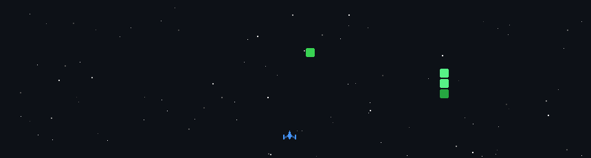

💫 🔭 I’m currently working on Frontend projects using HTML, CSS, JavaScript and React.  Also experimenting with simple AI integrations like chatbots using Node.js and OpenAI API.  👯 I’m looking to collaborate on Frontend web projects, UI/UX design work, and beginner-friendly open source projects related to React or JavaScript.  🤝 I’m looking for help with Improving my React.js skills, advanced frontend architecture, and building scalable UI components.  🌱 I’m currently learning React.js, modern frontend workflows, UI/UX design (Figma), and exploring AI-powered web applications.  💬 Ask me about HTML, CSS, JavaScript, Tailwind CSS, Bootstrap, basic React, UI design principles, and building responsive layouts.  ⚡ Fun fact I enjoy solving Sudoku puzzles and exploring design tools while improving my frontend development skills.

## 🌐 Socials:
           

# 💻 Tech Stack:
                           
# 📊 GitHub Stats:
 
 

## 🏆 GitHub Trophies

### ✍️ Random Dev Quote

### 🔝 Top Contributed Repo

---

*🚀 My GitHub Space Shooter Game*

  

